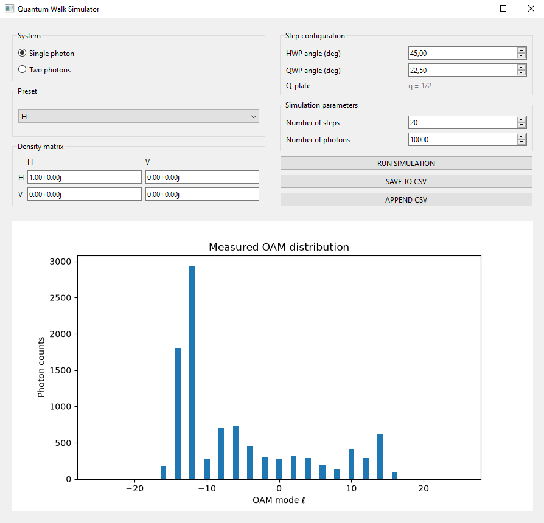

# quantum-state-ml
Simulations and code supporting an MSc thesis on quantum state reconstruction in single- and two-photon systems using machine learning.

## Quantum Walk Simulator
Currently this repository contains a quantum walk simulator developed as part of thesis work.

### Screenshot



### Current functionality

- Single-photon quantum walk simulation
- Polarization state initialisation using density matrices
- Polarization state initialisation using state presets
- Adjustable half-wave plate (HWP)
- Adjustable quarter-wave plate (QWP)
- Fixed q-plate
- Calculation of OAM probability distributions
- Photon sampling from the resulting distribution
- Histogram to visualise the simulated OAM measurements

### Planned features

- Two-photon support
- Data export
- GUI improvements

## Installation

### Clone the repository
```bash
git clone https://github.com/nkujanen/quantum-state-ml.git
cd quantum-state-ml
```

### Update dependencies
```bash
pip install -r requirements.txt
```

### Run the simulator
```bash
python main.py
```